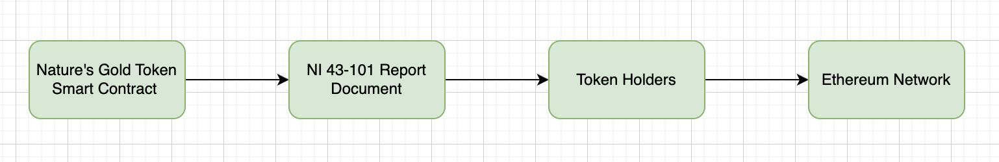
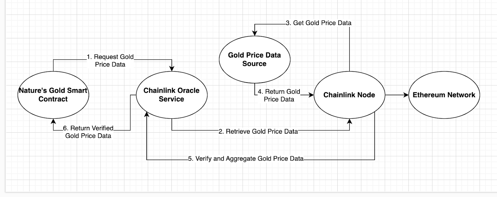
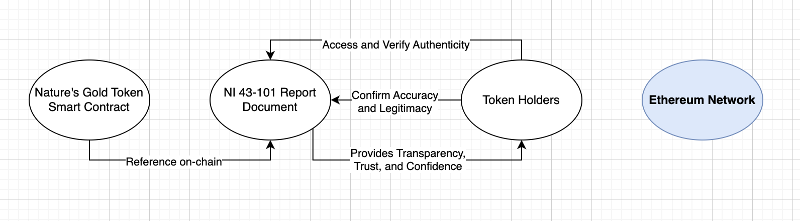

# Proof of Gold Reservation
## NI 43-101 Report and Gold Reserves
The NI 43-101 report is a globally recognized standard for mineral resource estimation and disclosure. It provides comprehensive information about mineral resources, their quality, and the potential economic viability of their extraction. In the context of Nature's Gold, the NI 43-101 report serves as a crucial document that details the gold reserves that back the NGOLD tokens.

## Diagram: Proof of Gold Reservation
Visualizing the process of how the NI 43-101 report contributes to the transparency and authenticity of our project:

In this diagram, we showcase the seamless integration of the NI 43-101 report into the Nature's Gold ecosystem:

- Nature's Gold Token Smart Contract: The smart contract references the NI 43-101 Report Document on-chain, making it accessible to all token holders.
- NI 43-101 Report Document: The NI 43-101 report, detailing information about the gold reserve backing NGOLD tokens, is stored on the blockchain.
- Token Holders: Token holders can access and verify the authenticity of the NI 43-101 Report Document directly from the blockchain. This verification process empowers token holders to confirm the accuracy and legitimacy of the gold reserve's information stated in the report.
- Ethereum Network: The blockchain network ensures the security and immutability of the NI 43-101 report, instilling trust and confidence in the Nature's Gold project.

## On-Chain Document Verification

Token holders can independently verify the authenticity of the NI 43-101 report by accessing it on-chain. This transparency ensures that the gold reserves backing NGOLD tokens are accurately represented and align with industry standards.

## Ensuring Transparency
By integrating the NI 43-101 report into the Nature's Gold ecosystem, we prioritize transparency and provide token holders with a means to validate the legitimacy of our gold reserves. This commitment to openness strengthens the foundation of our project and fosters a high level of trust among our community.

## Conclusion
The integration of the NI 43-101 report as a part of our Proof of Gold Reservation mechanism exemplifies our dedication to operating in a transparent and ethical manner. This documentation has illuminated how the report enhances the credibility of the gold reserves backing NGOLD tokens, reinforcing the confidence of our stakeholders.
