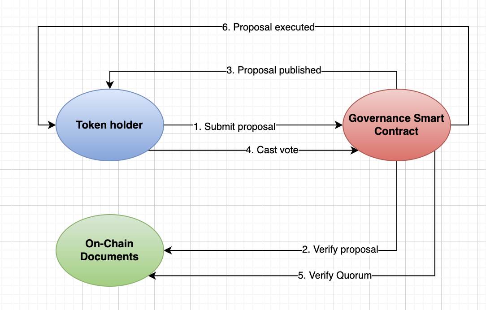
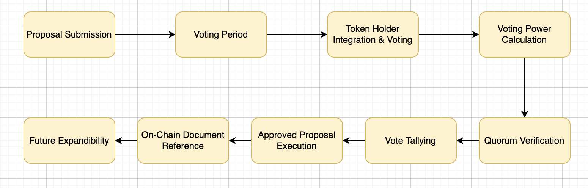

# Governance mechanism

### Introduction
The Nature's Gold Governance Mechanism empowers token holders to actively participate in the decision-making process for the project. By holding NGOLD tokens, token holders gain voting power proportional to the number of tokens they hold, ensuring a democratic and community-driven approach to key project decisions.

### Voting Power Calculation
Token holders accumulate voting power by holding NGOLD tokens. The more tokens held, the greater the voting power. Proportional voting power calculation ensures that larger holders have a significant but balanced influence on decisions.

### Submitting Governance Proposals
Anyone within the Nature's Gold community, including the project team and token holders, can submit governance proposals. Proposals should include clear details about the decision or change being proposed and why it benefits the project.

Voting on Governance Proposals
Voting takes place during predetermined timeframes. Token holders can cast their votes by interacting with the governance smart contract using their tokens. A quorum requirement ensures that a minimum level of participation is met for proposals to be considered valid.

### Proposal Approval and Execution
For a proposal to be approved, it must receive a majority vote from token holders. Once approved, the proposal is enacted through interaction with the relevant smart contracts. This could involve altering token parameters, updating documents, or triggering specific actions.

### Reference to On-Chain Documents
Nature's Gold Token contract has the unique ability to reference specific on-chain documents, such as mineral rights for the mine and the NI 43-101 report. This empowers token holders to independently verify the authenticity of these documents, fostering transparency and ensuring ethical operation.

### Future Expandability
While the initial focus is on token supply decisions, the Nature's Gold Governance Mechanism is designed for future growth. Additional voting categories, such as decisions related to mine acquisitions, project funding, and more, can be seamlessly integrated to accommodate evolving project needs.

### Governance Smart Contract Address
To interact with the Nature's Gold Governance Mechanism, refer to the smart contract address provided in the documentation. This address serves as the gateway for submitting proposals and casting votes.

### Flow Diagram
This diagram illustrates the key steps involved in submitting and approving proposals, voting, and executing approved changes.

- **Proposal Submission**
  - Anyone from the Nature's Gold community can initiate a proposal by submitting it through an interface provided by the governance smart contract.
  - The proposal should include detailed information about the proposed change, its benefits, and any relevant documentation.
  
- **Voting Period**
  - The governance smart contract sets a predetermined timeframe for the voting period.
  - During this period, token holders can cast their votes on the proposal.
  
- **Voting Process**
  - Token holders interact with the governance smart contract using their staked NGOLD tokens.
  - The smart contract calculates the voting power of each participant based on their staked tokens and the proportional voting power calculation formula.
  
- **Verification of Quorum**
  - The smart contract verifies if the minimum quorum requirement (minimum number of tokens needed for the vote to be valid) is met.

- **Voting Results**
  - At the end of the voting period, the smart contract tallies the votes cast in favor, against, or abstaining.
  - The results are calculated based on the total voting power, and the proposal's outcome is determined.

- **Proposal Approval and Execution**
  - If the proposal receives a majority vote in favor, it's considered approved.
  - The smart contract then executes the necessary actions or changes based on the approved proposal. This could involve adjusting token parameters, updating references to on-chain documents, or triggering other actions.

- **Verification of On-Chain Documents**
  - The Nature's Gold Token contract has the ability to reference on-chain documents.
  - Token holders can verify the authenticity of these documents directly from the blockchain, ensuring transparency and ethical operation.

- **Future Expandability**
  - The governance mechanism is designed to be extensible.
  - Additional voting categories can be added in the future, allowing for decisions beyond token supply adjustments. These could include decisions about mine acquisitions, project funding, and more.
- **Governance Smart Contract Interaction**
  - Token holders interact with the governance smart contract by submitting proposals, casting votes, and accessing information about ongoing and past proposals.
  - The smart contract handles voting calculations, quorum verification, and proposal execution.

